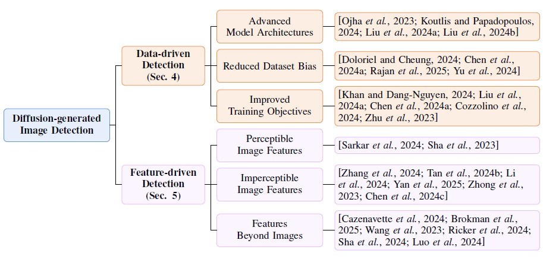

# A Survey on Generalizable Diffusion-generated Image Detection

**Qijie Xu, Defang Chen, Jiawei Chen, Siwei Lyu, Can Wang**

The repository is based on our recently released survey [Recent Advances on Generalizable Diffusion-generated Image Detection](https://arxiv.org/pdf/2502.19716).

## Abstract

The rise of diffusion models has significantly improved the fidelity and diversity of generated images. With numerous benefits, these advancements also introduce new risks. Diffusion models can be exploited to create high-quality Deepfake images, which poses challenges for image authenticity verification. In recent years, research on generalizable diffusion-generated image detection has grown rapidly. However, a comprehensive review of this topic is still lacking. To bridge this gap, we present a systematic survey of recent advances and classify them into two main categories: (1) data-driven detection and (2) feature-driven detection. Existing detection methods are further classified into six fine-grained categories based on their underlying principles. Finally, we identify several open challenges and envision some future directions, with the hope of inspiring more research work on this important topic.

## BibTex

If you find our survey useful for your research project, please consider citing our paper:

```BibTex
@article{xu2025recent,
  title={Recent Advances on Generalizable Diffusion-generated Image Detection},
  author={Xu, Qijie and Chen, Defang and Chen, Jiawei and Lyu, Siwei and Wang, Can},
  journal={arXiv preprint arXiv:2502.19716},
  year={2025}
}
```

## Contents

- [Overview](#overview)
- [Papers](#papers)
  - [Data-driven Detection](#data-driven-detection)
  - [Feature-driven Detection](#feature-driven-detection)
    - [Perceptible Image Features](#perceptible-image-features)
    - [Imperceptible Image Features](#imperceptible-image-features)
    - [Features Beyonds images](#features-beyonds-images)

# Overview



# Papers

## Data-driven Detection

We classify data-driven detection methods into three categories: (1) advanced model architectures, (2) reduced dataset bias, and (3) improved training objectives, denoted as "Architecture", "Dataset" and "Objective" in the table, respectively.

| Title | Category | Year | Publication |
| - | :-: | :-: | :-: |
| [Towards Universal Fake Image Detectors that Generalize Across Generative Models](https://arxiv.org/abs/2302.10174) | Architecture | 2023 | CVPR|
| [GenDet: Towards Good Generalizations for AI-Generated Image Detection](https://arxiv.org/abs/2312.08880) | Objective | 2023 | |
| [Forgery-aware Adaptive Transformer for Generalizable Synthetic Image Detection](https://arxiv.org/abs/2312.16649) | Architecture + Objective | 2024 | CVPR |
| [Frequency Masking for Universal Deepfake Detection](https://arxiv.org/abs/2401.06506) | Dataset | 2024 | ICASSP |
| [DRCT: Diffusion Reconstruction Contrastive Training towards Universal Detection of Diffusion Generated Images](https://proceedings.mlr.press/v235/chen24ay.html) | Dataset + Objective | 2024 | ICML |
| [CLIPping the Deception: Adapting Vision-Language Models for Universal Deepfake Detection](https://arxiv.org/abs/2402.12927) | Objective | 2024 | ICMR |
| [Leveraging Representations from Intermediate Encoder-blocks for Synthetic Image Detection](https://arxiv.org/abs/2402.19091) | Architecture | 2024 | ECCV |
| [Zero-Shot Detection of AI-Generated Images](https://arxiv.org/abs/2409.15875) | Objective | 2024 | ECCV |
| [Mixture of Low-rank Experts for Transferable AI-Generated Image Detection](https://arxiv.org/abs/2404.04883) | Architecture | 2024 | |
| [SemGIR: Semantic-Guided Image Regeneration Based Method for AI-generated Image Detection and Attribution](https://dl.acm.org/doi/abs/10.1145/3664647.3680776) | Dataset | 2024 | ACM MM |
| [Aligned Datasets Improve Detection of Latent Diffusion-Generated Images](https://arxiv.org/abs/2410.11835v3) | Dataset | 2025 | ICLR |


## Feature-driven Detection

### Perceptible Image Features

| Title | Year | Publication |
| - | :-: | :-: |
| [DE-FAKE: Detection and Attribution of Fake Images Generated by Text-to-Image Generation Models](https://arxiv.org/abs/2210.06998) | 2023 | CCS |
| [Shadows Don't Lie and Lines Can't Bend! Generative Models don't know Projective Geometry...for now](https://arxiv.org/abs/2311.17138) | 2024 | CVPR |

### Imperceptible Image Features

| Title | Year | Publication |
| - | :-: | :-: |
| [PatchCraft: Exploring Texture Patch for Efficient AI-generated Image Detection](https://arxiv.org/abs/2311.12397) | 2023 | |
| [Rethinking the Up-Sampling Operations in CNN-based Generative Network for Generalizable Deepfake Detection](https://arxiv.org/abs/2312.10461) | 2024 | CVPR |
| [A Single Simple Patch is All You Need for AI-generated Image Detection](https://arxiv.org/abs/2402.01123) | 2024 | |
| [Improving Synthetic Image Detection Towards Generalization: An Image Transformation Perspective](https://arxiv.org/abs/2408.06741) | 2024 | |
| [A Sanity Check for AI-generated Image Detection](https://arxiv.org/abs/2406.19435) | 2025 | ICLR |
| [Leveraging Natural Frequency Deviation for Diffusion-Generated Image Detection](https://openreview.net/pdf?id=fPBExgC1m9) | 2025 | |


### Features Beyonds images

| Title | Year | Publication |
| - | :-: | :-: |
| [DIRE for Diffusion-Generated Image Detection](https://arxiv.org/abs/2303.09295) | 2023 | ICCV |
| [AEROBLADE: Training-Free Detection of Latent Diffusion Images Using Autoencoder Reconstruction Error](https://arxiv.org/abs/2401.17879) | 2024 | CVPR |
| [FakeInversion: Learning to Detect Images from Unseen Text-to-Image Models by Inverting Stable Diffusion](https://arxiv.org/abs/2406.08603) | 2024 | CVPR |
| [LaRE$^2$: Latent Reconstruction Error Based Method for Diffusion-Generated Image Detection](https://arxiv.org/abs/2403.17465) | 2024 | CVPR |
| [ZeroFake: Zero-Shot Detection of Fake Images Generated and Edited by Text-to-Image Generation Models](https://dl.acm.org/doi/abs/10.1145/3658644.3690297) | 2024 | CCS |
| [Manifold Induced Biases for Zero-shot and Few-shot Detection of Generated Images](https://openreview.net/pdf?id=7gGl6HB5Zd) | 2025 | ICLR |